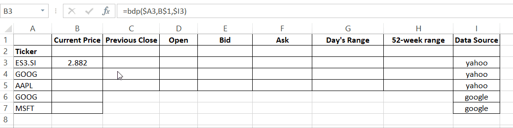
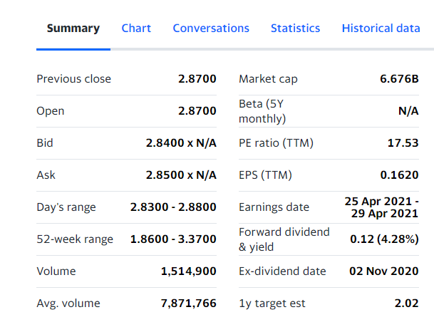

# Excel Stock/Crypto Price Extraction

This repository provides an excel addin with user defined functions to scrape stock market data from Yahoo and Google Finance, and Crypto data from FTX.

We only support current price `CURRENT PRICE` for Google Finance and FTX data source while the full list of fields supported for Yahoo Finance can be found below.

This addin is only tested to be working on Windows platform.



## Getting Started

These instructions will get you a copy of the project up and running on your local machine for development and testing purposes.

### Prerequisites

What things you need to build the software (Not required if taking the dll files directly) and how to install them

- Visual Studio 2019

### Installing

A step by step series of examples that tell you how to get a development env running

```
Download latest release (Depending on whether Excel is 32 or 64bit, choose StockScaper-AddIn*-packed.xll file)
Open Excel > File > Options > Add-ins > Manage Excel Add-ins > Browse >
Pre-built binaries can also be found in StockScraper/StockScraper/bin/Debug/ 
```

To build the project from source:

```
Build the project with the .sln file
```

Link the generated xll file

```
Follow the first step
```

### Usage

Fields in brackets are optional and does not need to be specified.
To get the latest market data for an exchange traded ticker:

```
Syntax: =bdp( {ticker}, [{yahoo field}], [{data source}] )

Yahoo Finance Data Source
=bdp("ES3.SI") - STI ETF's current price
=bdp("AAPL", "foward dividend & yield") - Apple's dividend yield
=bdp("AAPL", "current price") - Apple's current price
=bdp("MSFT", "volume") - Microsoft's volume traded

Google Finance Data Source
=bdp("goog",,"google") - Google's current price
=bdp("aapl",,"google") - Apple's current price

FTX Data Source
=bdp("btc/usd",,"ftx") - BTC/USD's current price
=bdp("btc-0924",,"ftx") - BTC/USD's September futures price
```

List of available fields

```
PREVIOUS CLOSE,
CURRENT PRICE,
OPEN,
BID,
ASK,
DAY'S RANGE,
52-WEEK RANGE,
VOLUME,
AVG. VOLUME,
NET ASSETS,
NAV,
PE RATIO (TTM),
YIELD,
YTD DAILY TOTAL RETURN,
BETA (5Y MONTHLY),
EXPENSE RATIO (NET),
INCEPTION DATE
MARKET CAP,
EPS (TTM),
EARNINGS DATE,
FORWARD DIVIDEND & YIELD,
EX-DIVIDEND DATE,
1Y TARGET EST
```

Available fields for yahoo data source differs based on the type of ticker, for example, `yield` is only available for etfs while `forward dividend & yield` is only available for single tock.

To check if a field is available for a particular ticker, please check the summary table from yahoo finance directly.


